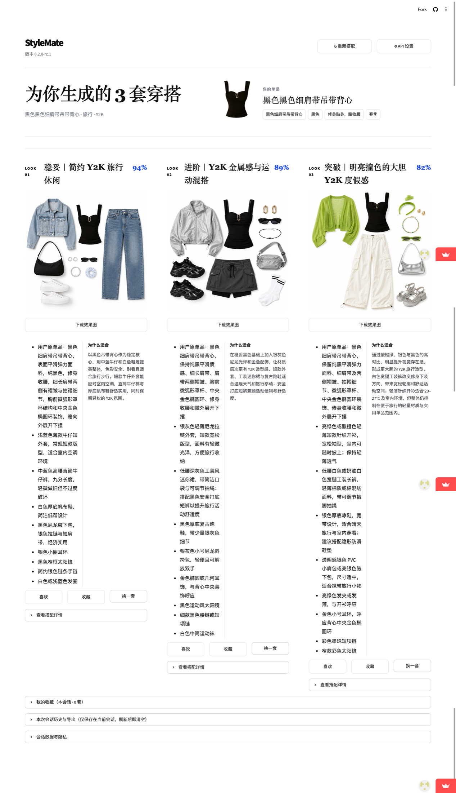
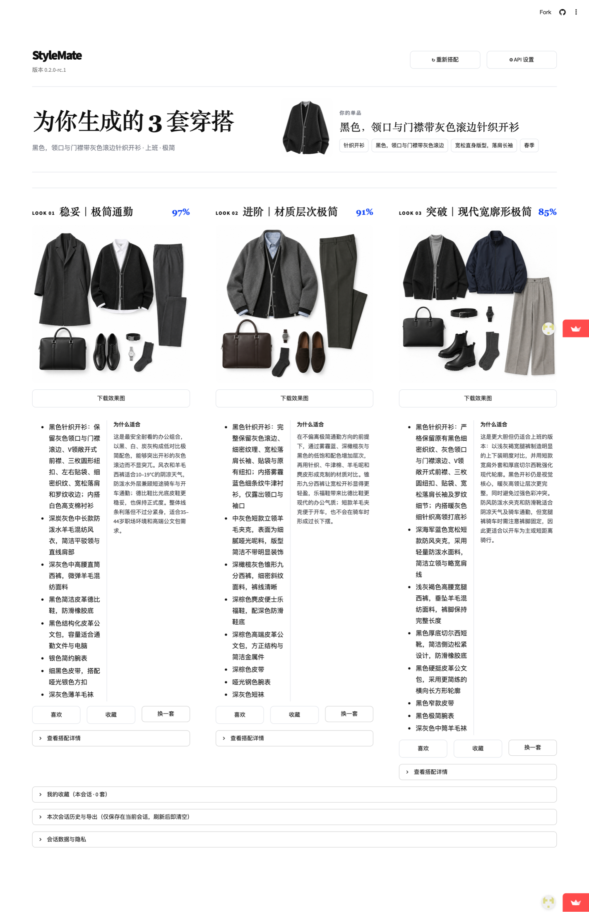

# StyleMate — 多模态 AI 穿搭助手

从单件服装照片出发，完成结构化识别、可编辑确认、三套可解释搭配与可选平铺图生成的 Streamlit 应用。

[](.python-version)
[](requirements.txt)
[](https://github.com/liuyijing2006010708-create/stylemate-ai-outfit/actions/workflows/ci.yml)
[](LICENSE)
[](CHANGELOG.md)

[在线体验](https://stylemate-ai-outfit.streamlit.app/) · [快速开始](#快速开始) · [项目文档](#项目文档) · [版本记录](CHANGELOG.md)

## 项目概览

StyleMate 面向“已经有一件衣服，但不知道如何搭配”的场景。用户上传单品照片后，可以确认或修正识别结果，再结合场景、天气、通勤方式和个人偏好生成三套定位不同的搭配。真实模型调用使用用户自己的 API Key；无 Key 时可显式进入固定 Demo，Demo 不会读取上传图片或调用模型。

核心流程：

```text
单品照片 → 图片预处理 → 结构化识别 → 用户确认 → 三套候选搭配
         → 约束与差异度校验 → 偏好排序 → 可选平铺图 → 会话历史与导出
```

## 项目示例

`examples/` 提供女士与男士两条完整演示流程。示例中的“AI 推荐度”是候选排序依据，不是经过离线评测标定的准确率；生成图也需要人工核对原单品特征和场景实用性。

| 女士流程 | 男士流程 |
| -------- | -------- |
|  |  |

每条流程均包含：

- 原始单品：[`female/source.png`](examples/female/source.png) / [`male/source.jpg`](examples/male/source.jpg)
- 输入设置：[`female/input-settings.png`](examples/female/input-settings.png) / [`male/input-settings.png`](examples/male/input-settings.png)
- 识别确认：[`female/recognition-confirm.png`](examples/female/recognition-confirm.png) / [`male/recognition-confirm.png`](examples/male/recognition-confirm.png)
- 结果总览：[`female/result-overview.png`](examples/female/result-overview.png) / [`male/result-overview.png`](examples/male/result-overview.png)

## 功能

- 支持 JPG、PNG、WEBP 单品图片，上传前验证格式、大小、像素并清除图片元数据。
- 通过 Responses API 或 Chat Completions 完成视觉识别和结构化搭配规划。
- 识别结果可编辑确认，搭配输入支持场景、天气、通勤、预算、禁用单品、可选性别和年龄段。
- 生成“稳妥 / 进阶 / 突破”三套候选，并执行字段完整性、硬约束和启发式差异度校验。
- 文本清单与生图提示词来自同一份结构化数据；平铺图默认按需逐张生成。
- 支持 OpenAI 及 OpenAI-compatible API endpoints，并允许文本与生图分别配置 Base URL、模型和 API Key。
- 保留最近 4 批会话历史和最多 20 套收藏，可导出图片与文字清单。
- 提供固定 Demo、错误分类、请求编号、调用限流、异步任务续查和移动端布局。

完整的数据流、模块边界和安全设计见[架构说明](docs/architecture.md)。

## 快速开始

推荐使用 Python 3.12，与 `.python-version`、部署环境和 CI 保持一致。

```bash
git clone https://github.com/liuyijing2006010708-create/stylemate-ai-outfit.git
cd stylemate-ai-outfit

python -m venv .venv
source .venv/bin/activate
python -m pip install -r requirements.txt

cp .env.example .env
python -m streamlit run app.py
```

Windows PowerShell 使用以下命令激活虚拟环境：

```powershell
.venv\Scripts\Activate.ps1
```

打开页面后：

- 查看固定 Demo 不需要 API Key。
- 识别自己的图片、生成真实搭配或平铺图，需要填写自己的 API Key、Base URL 和模型名。
- `.env` 仅用于本地配置且已被 Git 忽略；也可以不编辑 `.env`，直接在页面中配置。

云端公开入口使用 `cloud_app.py`，部署步骤见 [DEPLOY.md](DEPLOY.md)。

## 配置

本地默认配置如下：

| Variable | Required | Default | Description |
| -------- | -------- | ------- | ----------- |
| `OPENAI_API_KEY` | 真实调用需要 | 空 | 本地启动时使用的 API Key |
| `OPENAI_BASE_URL` | 否 | `https://api.openai.com/v1` | 文本接口 Base URL |
| `OPENAI_TEXT_MODEL` | 否 | `gpt-4.1-mini` | 视觉识别与搭配规划模型 |
| `OPENAI_IMAGE_MODEL` | 否 | `gpt-image-1` | 图片编辑模型 |

其他变量、页面配置优先级和部署差异见[配置指南](docs/configuration.md)；协议能力与端点要求见 [Provider 指南](docs/providers.md)。

## 项目结构

```text
.
├── app.py                    # 本地 Streamlit 入口与页面状态流
├── cloud_app.py              # Streamlit Community Cloud 公开入口
├── stylemate/                # 业务模型、AI 调用、排序、安全与运行时
├── stylegen/                 # StyleGen 数据读取与训练数据契约
├── scripts/                  # 数据准备、检查、打包与演示脚本
├── tests/                    # 单元、集成和 Streamlit 流程测试
├── examples/{female,male}/   # 两条完整产品流程示例
├── assets/                   # 固定 Demo 素材
├── design/                   # 界面设计参考
├── docs/                     # 配置、Provider、架构与训练文档
└── .github/                  # CI 与开源协作模板
```

## 测试

```bash
python -m pip install -r requirements-dev.txt
python -m pip check
python -m compileall -q app.py cloud_app.py stylemate stylegen scripts
python -m pytest -q
```

自动化测试使用替身或 `MockTransport` 隔离外部 API，不发送真实付费请求。GitHub Actions 对每次 push 和 Pull Request 运行同等检查，并额外执行依赖漏洞审计。

## 项目文档

| Document | Description |
| -------- | ----------- |
| [Configuration](docs/configuration.md) | API 与环境变量配置 |
| [Providers](docs/providers.md) | OpenAI-compatible 协议和端点要求 |
| [Architecture](docs/architecture.md) | Pipeline、模块边界和安全设计 |
| [Deployment](DEPLOY.md) | Streamlit Community Cloud 部署与更新 |
| [StyleGen](docs/training.md) | 数据准备、检查和训练实验约定 |
| [StyleGen specification](STYLEGEN_SPEC.md) | M1 数据里程碑验收条件 |
| [Changelog](CHANGELOG.md) | 版本历史 |
| [Contributing](CONTRIBUTING.md) | 本地开发与 Pull Request 规范 |
| [Security](SECURITY.md) | API Key、用户图片与漏洞报告政策 |

历史验收资料保留在 [P1/P2 验收记录](P1P2_ACCEPTANCE.md)和 [P0-1 发布记录](RELEASE_P0_1.md)，用于说明项目演进过程，不作为当前配置指南。

## Roadmap

- 扩展候选集合，并在 `stylemate/ranking.py` 接入可训练的兼容度排序模型。
- 使用 Polyvore compatibility 数据完成 StyleGen Base / LoRA 对照实验。
- 在不扩大默认部署负担的前提下评估 SAM2 分割与持久化用户画像。

Roadmap 表示计划方向，不代表当前版本已经提供这些能力。训练数据和实验流程见 [StyleGen 指南](docs/training.md)。

## 参与贡献

欢迎通过 Issue 报告可复现问题或提出需求。提交代码前请阅读 [CONTRIBUTING.md](CONTRIBUTING.md)，并确保测试和相关文档同步更新。

## 安全与隐私

API Key、上传图片和生成结果只保存在当前 Streamlit 会话内存中，不写入项目文件或数据库。真实调用会把图片和提示词发送给用户配置的第三方服务商；使用前应核对其隐私和计费政策。请勿在 Issue、Pull Request 或日志中提交任何密钥和个人图片。更多边界与漏洞报告方式见 [SECURITY.md](SECURITY.md)。

## License

本项目基于 [MIT License](LICENSE) 开源。
