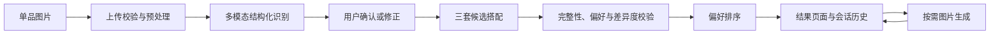

# 架构说明

StyleMate 是单进程 Streamlit 应用。页面状态编排位于 `app.py`，可测试的领域模型、模型调用、排序、校验、安全和图片处理逻辑位于 `stylemate/`。`cloud_app.py` 只负责以公开部署模式执行相同应用。

## 处理流程

识别、搭配和单套替换返回 Pydantic 模型。结果页面、文字导出和生图提示词从同一份结构化 `Outfit` 字段生成，以降低图文输入不一致；模型生成的最终像素仍需要人工核对。

## 模块边界

| Module | Responsibility |
| ------ | -------------- |
| `app.py` | Streamlit 页面、会话状态、用户操作与流程编排 |
| `stylemate/models.py` | 服装识别、单套搭配和三套计划的数据契约 |
| `stylemate/openai_service.py` | Responses API、Chat Completions 与图片生成路由 |
| `stylemate/runtime.py` | 配置归一化、Provider 判断、验证与安全错误映射 |
| `stylemate/consistency.py` | 字段完整性、候选差异和禁用单品校验 |
| `stylemate/ranking.py` | 当前轻量偏好排序，以及未来可训练排序器的替换点 |
| `stylemate/preprocessing.py` | 旋转、裁剪、质量提示与可选背景移除 |
| `stylemate/uploads.py` | 上传格式、大小、像素、解码和元数据清理 |
| `stylemate/security.py` | 公网 URL / DNS 校验、固定 IP 连接与日志保护 |
| `stylemate/operations.py` | 会话与 Key 哈希维度的操作限流 |
| `stylegen/` | 独立的训练数据读取和 StyleGen 数据契约 |

## Provider 抽象

`APIConfig` 将文本和图片的 Key、Base URL、模型及文本协议归一化。默认路径使用 OpenAI Python SDK，因此未列名的服务只要实现所需协议，就作为通用 OpenAI-compatible endpoint 使用。

这种边界避免把私人网关或普通兼容服务写成架构组件。新增普通兼容服务不需要改源码；如果未来支持不同协议，应通过通用、可配置的抽象实现，并增加独立测试。

## 会话与历史

- API Key、上传图片、识别结果、搭配和收藏保存在 Streamlit 会话内存。
- 当前实现没有用户账号或持久化数据库；刷新、断线、会话过期或服务重启可能丢失状态。
- 历史按本地生成的批次 ID 隔离，避免模型重复返回 LOOK 编号时相互覆盖。
- 已开始的搭配批次保留当时的 API 配置，后续修改设置不会把新 Key 用于旧批次的逐张生图。

## 安全边界

- 上传文件在发送前验证真实格式、字节数、像素数和解码结果，并重新编码以移除元数据。
- 用户填写的 Base URL 是不可信输入：仅允许 HTTPS 公网地址，验证 DNS 全部结果，禁止重定向和环境代理。
- 外部模型输出按 Pydantic 数据契约解析，再经过完整性和业务约束校验。
- 页面错误使用固定分类，不回显服务商响应正文；诊断日志不记录 Key、图片或提示词。
- 单进程限流降低误操作和重复费用风险，但不是多实例共享配额系统。
- 第三方 Provider 会接触用户提交的 Key、图片和提示词；其数据处理不受本仓库控制。

完整配置见 [配置指南](configuration.md)，端点要求见 [Provider 指南](providers.md)，漏洞报告方式见 [`../SECURITY.md`](../SECURITY.md)。
